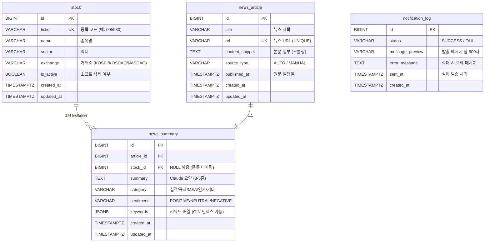

# ERD - Finance Bot DB 설계

---

## 메타
| 항목 | 내용 |
|------|------|
| **버전** | v1.2 |
| **작성일** | 2026-03-15 |
| **상태** | 구현 완료 (Week 1) |
| **DBMS** | PostgreSQL 15 (Supabase) |
| **스키마** | `public` |
| **문자셋** | UTF-8 (기본, 한국어/이모지 지원) |

### 변경 이력
| 버전 | 날짜 | 내용 |
|------|------|------|
| v1.0 | 2026-03-15 | 초안 작성 (stock, news_article, news_summary, notification_log) |
| v1.1 | 2026-03-15 | MySQL → Supabase(PostgreSQL)로 전환. JSONB·TIMESTAMPTZ·CHECK 제약 적용 |
| v1.2 | 2026-03-15 | Week 1 Flyway 마이그레이션 구현 완료. V1__init_schema.sql, V2__add_index.sql 적용 |

---

## ERD 다이어그램



---

## 테이블 상세

### stock (관심 종목)

| 컬럼 | 타입 | NULL | 기본값 | 설명 |
|------|------|------|--------|------|
| id | BIGINT | NO | GENERATED ALWAYS AS IDENTITY | PK |
| ticker | VARCHAR(20) | NO | - | 종목 코드. UNIQUE 제약 |
| name | VARCHAR(100) | NO | - | 종목명 |
| sector | VARCHAR(50) | YES | NULL | 섹터 (예: 반도체, 금융) |
| exchange | VARCHAR(20) | YES | NULL | 거래소 (KOSPI/KOSDAQ/NASDAQ) |
| is_active | BOOLEAN | NO | TRUE | 소프트 삭제 플래그 |
| created_at | TIMESTAMPTZ | NO | - | BaseEntity 자동 관리 |
| updated_at | TIMESTAMPTZ | NO | - | BaseEntity 자동 관리 |

---

### news_article (뉴스 원문)

| 컬럼 | 타입 | NULL | 기본값 | 설명 |
|------|------|------|--------|------|
| id | BIGINT | NO | GENERATED ALWAYS AS IDENTITY | PK |
| title | VARCHAR(500) | NO | - | 뉴스 제목 |
| url | VARCHAR(2000) | NO | - | 뉴스 URL. UNIQUE 제약 |
| content_snippet | TEXT | YES | NULL | 본문 일부 (크롤링 결과) |
| source_type | VARCHAR(10) | NO | - | `AUTO` / `MANUAL`. CHECK 제약 |
| published_at | TIMESTAMPTZ | YES | NULL | 원문 발행일 (크롤링 파싱, 없으면 NULL) |
| created_at | TIMESTAMPTZ | NO | - | 시스템 저장 시각 |
| updated_at | TIMESTAMPTZ | NO | - | 자동 갱신 |

---

### news_summary (AI 분석 결과)

| 컬럼 | 타입 | NULL | 기본값 | 설명 |
|------|------|------|--------|------|
| id | BIGINT | NO | GENERATED ALWAYS AS IDENTITY | PK |
| article_id | BIGINT | NO | - | FK → news_article.id |
| stock_id | BIGINT | YES | NULL | FK → stock.id. 종목 미매핑 시 NULL |
| summary | TEXT | NO | - | Claude 생성 한국어 요약 (3-5줄) |
| category | VARCHAR(50) | YES | NULL | 실적 / 규제 / M&A / 인사 / 기타 |
| sentiment | VARCHAR(10) | NO | - | `POSITIVE` / `NEUTRAL` / `NEGATIVE`. CHECK 제약 |
| keywords | JSONB | YES | NULL | 키워드 배열. 예: `["HBM3E", "반도체"]` |
| created_at | TIMESTAMPTZ | NO | - | 자동 관리 |
| updated_at | TIMESTAMPTZ | NO | - | 자동 관리 |

---

### notification_log (카카오톡 발송 이력)

| 컬럼 | 타입 | NULL | 기본값 | 설명 |
|------|------|------|--------|------|
| id | BIGINT | NO | GENERATED ALWAYS AS IDENTITY | PK |
| status | VARCHAR(10) | NO | - | `SUCCESS` / `FAIL`. CHECK 제약 |
| message_preview | VARCHAR(500) | YES | NULL | 발송 메시지 앞 500자 |
| error_message | TEXT | YES | NULL | 실패 시 오류 상세 (카카오 API 응답 등) |
| sent_at | TIMESTAMPTZ | NO | - | 발송 시도 시각 |
| created_at | TIMESTAMPTZ | NO | - | 레코드 생성 시각 |

---

## 인덱스 전략

```sql
-- 유니크 인덱스
CREATE UNIQUE INDEX uk_stock_ticker ON stock (ticker);
CREATE UNIQUE INDEX uk_news_url ON news_article (url);

-- 조회 성능 인덱스
-- 뉴스 목록 조회: 종목별 최신순
CREATE INDEX idx_news_summary_stock_created
  ON news_summary (stock_id, created_at DESC);

-- 발송 이력 최신순 조회
CREATE INDEX idx_notification_sent_at
  ON notification_log (sent_at DESC);

-- 자동/수동 분류별 조회
CREATE INDEX idx_news_article_source_type
  ON news_article (source_type, created_at DESC);

-- JSONB 키워드 GIN 인덱스 (키워드 포함 검색 시 활용)
CREATE INDEX idx_news_summary_keywords
  ON news_summary USING GIN (keywords);
```

---

## Flyway 마이그레이션

**파일 경로**: `api-server/src/main/resources/db/migration/`

```
V1__init_schema.sql          # 전체 테이블 생성
V2__add_index.sql            # 인덱스 추가
```

**초기 스키마 SQL (PostgreSQL):**
```sql
CREATE TABLE stock (
  id         BIGINT GENERATED ALWAYS AS IDENTITY PRIMARY KEY,
  ticker     VARCHAR(20) NOT NULL,
  name       VARCHAR(100) NOT NULL,
  sector     VARCHAR(50),
  exchange   VARCHAR(20),
  is_active  BOOLEAN NOT NULL DEFAULT TRUE,
  created_at TIMESTAMPTZ NOT NULL,
  updated_at TIMESTAMPTZ NOT NULL,
  CONSTRAINT uk_stock_ticker UNIQUE (ticker)
);

CREATE TABLE news_article (
  id               BIGINT GENERATED ALWAYS AS IDENTITY PRIMARY KEY,
  title            VARCHAR(500) NOT NULL,
  url              VARCHAR(2000) NOT NULL,
  content_snippet  TEXT,
  source_type      VARCHAR(10) NOT NULL,
  published_at     TIMESTAMPTZ,
  created_at       TIMESTAMPTZ NOT NULL,
  updated_at       TIMESTAMPTZ NOT NULL,
  CONSTRAINT uk_news_url    UNIQUE (url),
  CONSTRAINT chk_source_type CHECK (source_type IN ('AUTO', 'MANUAL'))
);

CREATE TABLE news_summary (
  id          BIGINT GENERATED ALWAYS AS IDENTITY PRIMARY KEY,
  article_id  BIGINT NOT NULL,
  stock_id    BIGINT,
  summary     TEXT NOT NULL,
  category    VARCHAR(50),
  sentiment   VARCHAR(10) NOT NULL,
  keywords    JSONB,
  created_at  TIMESTAMPTZ NOT NULL,
  updated_at  TIMESTAMPTZ NOT NULL,
  CONSTRAINT fk_summary_article FOREIGN KEY (article_id) REFERENCES news_article(id),
  CONSTRAINT fk_summary_stock   FOREIGN KEY (stock_id)   REFERENCES stock(id),
  CONSTRAINT chk_sentiment      CHECK (sentiment IN ('POSITIVE', 'NEUTRAL', 'NEGATIVE'))
);

CREATE TABLE notification_log (
  id               BIGINT GENERATED ALWAYS AS IDENTITY PRIMARY KEY,
  status           VARCHAR(10) NOT NULL,
  message_preview  VARCHAR(500),
  error_message    TEXT,
  sent_at          TIMESTAMPTZ NOT NULL,
  created_at       TIMESTAMPTZ NOT NULL,
  CONSTRAINT chk_status CHECK (status IN ('SUCCESS', 'FAIL'))
);
```

---

## Supabase 연결 정보

| 항목 | 값 |
|------|-----|
| **Host** | `db.{project-ref}.supabase.co` |
| **Port** | `5432` (direct) / `6543` (pgBouncer 풀링) |
| **Database** | `postgres` |
| **Schema** | `public` |
| **Spring Boot JDBC URL** | `jdbc:postgresql://db.{project-ref}.supabase.co:5432/postgres` |

> 운영 환경은 pgBouncer(6543 포트) 사용 권장 (연결 수 최적화)
